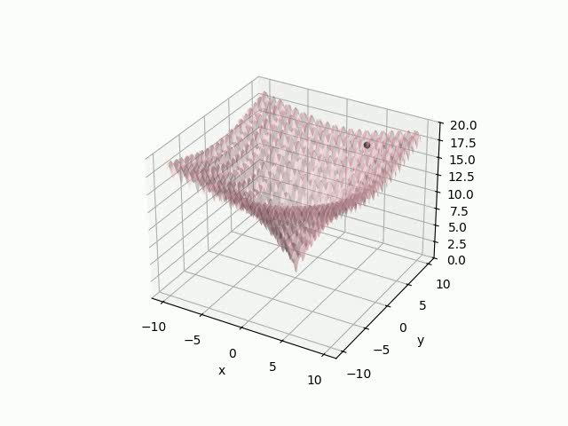

# video simulation for optimization (C++ version)

The Ackley function is a mathematical test function that is often used to test how well algorithms can find a global minima among many other local minima. This code is written in C++ and Python to help you visualize how an optimal minimum point can be found in an Ackley function in 3D.

The Ackley function can be represented as:

$f(x) = -a \exp(-b\sqrt(\frac{1}{n}\sum_{i=1}^d x_i^2))-\exp(\frac{1}{d}\sum_{i=1}^d \cos(cx_i))+a+\exp(1)$

where recommended parameters are __$a=20$__, __$b=0.2$__, and __$c=2\pi$__, which are what this code uses.

## explanations for modules & cells

#### README
- What you are reading right now :o

#### ackleyfunction.cpp
- This is the C++ code for generating random coordinates for each iteration and saving the minimum xyz coordinates. Then it outputs the coordinates as a txt file (saved_xyz_coordinates.txt). This C++ code MUST BE RUN BEFORE videogenerator.ipynb.

#### videogenerator.ipynb
- This is a python code reading the txt file and generating/saving 3D graph images of each coordinate recorded in txt. Then, it uses those images to create an mp4 file where you can visually track the points getting smaller and smaller. 

#### graphimages
- This is a folder where the output 3D graph images of the local minima for each iteration of the loop will be saved. Images are saved in png and are numbered in the order the loops are run. 

### cells for Python!
#### required imports
- All required packages imported here

#### file importer
- Imports txt file and appends it to array
- Optional: Can check if points have been correctly appended by running the commented out section in this cell

#### graph plotter
- Plots 3D graph of each coordinate in the array using a for loop, saves each image in graphimages.

#### save as video
- All output images in graphimages outputted as a single mp4 video. Can now visually track point on graph moving towards (0,0,0).

### the end

p.s.
poem recs: this is just to say by william carlos williams <3
